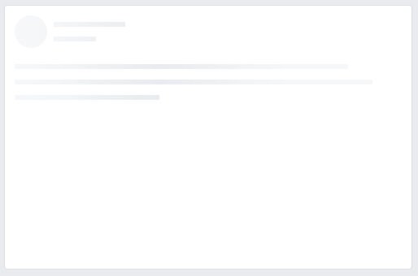
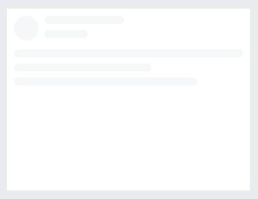

# チャレンジ6

```
所要時間: 30分〜1時間
ステータス: 公開
タイプ: 課題
```

## 目的

- CSSアニメーションを実際に使ってみる

## チャレンジの取り組み方

1. マイルストーンごとに要件に合うようにファイルを編集していきます。
2. 分からない部分があれば、テキストを復習して、再度チャレンジしてみましょう。
3. 再チャレンジしてしばらく考えても分からない場合はチャットでメンターに質問しましょう。
4. 完成したら、Dropboxでメンターとファイルを共有して下さい。
5. メンターから課題レビューが届きます。
6. ビデオチャットの際は、分からない点を更に突っ込んで聞いたり、より良い書き方を聞いてみましょう。

## 概要

FacebookやTwitterを開いた時に、読み込み中にグレーで表示されそうな写真と文章が表示されるアニメーションを見たことがある方は多いかと思います。



今回は、これに近いFacebook風ローディングアニメーションを作ってみましょう。

## スターターファイル

以下のURLのコードをテンプレートとして利用して下さい。

- [codegrit-html-css-ch06-starter](https://github.com/codegrit-jp-students/codegrit-html-css-ch06-starter)


## マイルストーン1

### スペック

- htmlファイルを開くとすぐにローディング画面の表示が始まります。
- アニメーションのスタイルはFacebookの場合左から右に流れるように表示していますが、今回は簡単に色が変わるだけのものを実装してみましょう。

## ヒント

- 以下のサンプル画像を参考にしてください。




## 評価

課題の後、以下の２つについてメンターにフィードバックをお願いします。

1. 要件のカバー度: 1.全く出来なかった 2.ほとんど出来なかった 3. 半分ほどは出来た 4.8割ほどは出来た 5. 全部出来た
2. 難易度: 1. とても難しかった 2. 難しかった 3. ちょうど良かった 4. 簡単だった 5. とても簡単だった
